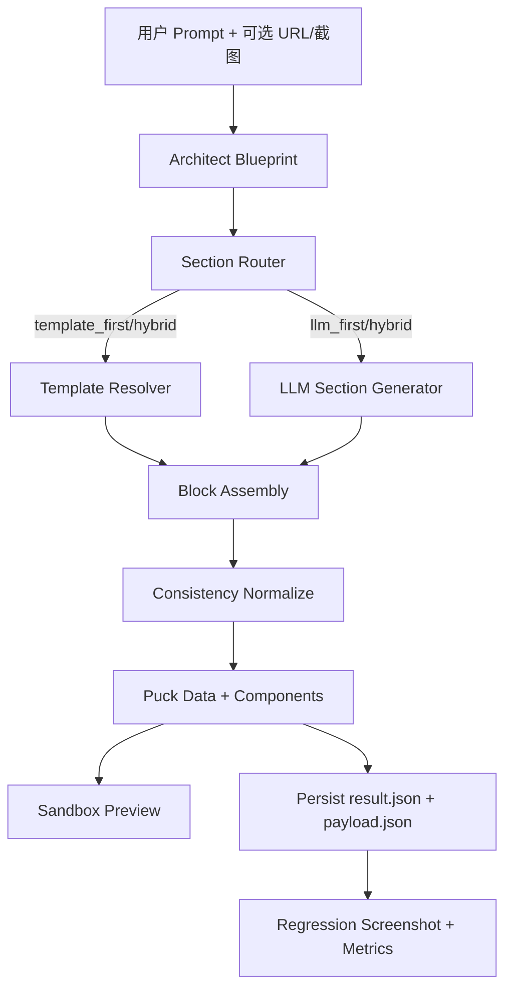

# Builder 模板库与网站生成系统设计文档

**版本**: v3.0  
**日期**: 2026-02-18（v3.0 更新：语义匹配 + 深度个性化 + LLM 精修层）  
**适用范围**: `builder`（Puck JSON 生成、Sandbox 预览、回归评估）

---

## 1. 文档目标

本文档基于当前代码实现，定义一套可落地的“模板优先 + 受控 LLM”生成方案，目标是：

1. 提升稳定性：减少 `builder_section_fallback`、`tool_missing`、`layout_invalid`。
2. 提升一致性：减少字体/配色/布局漂移。
3. 保留创造力：在高冲击区块允许 LLM 受控生成。
4. 可运维：支持模板持续新增、A/B/C 策略对比、截图回归。

---

## 2. 现状基线（As-Is）

### 2.1 核心代码入口

- 生成 API: `builder/src/app/api/creation/route.ts`
- 主编排图: `builder/src/lib/agent/p2w-graph.ts`
- 模板注册表: `builder/src/lib/agent/section-template-registry.ts`
- Puck 渲染配置: `builder/src/puck/config.ts`
- Sandbox 页面: `builder/src/app/creation/sandbox/page.tsx`
- Sandbox 客户端: `builder/src/app/creation/sandbox-client.tsx`
- 策略回归: `builder/regression/run-strategy-comparison.mjs`

### 2.2 当前能力

1. 已支持三种 section 路由策略：`llm_first | hybrid | template_first`。  
2. 已有 `StyleProfile[]` 模板机制（按 prompt 关键词命中 -> 按 section kind 返回 `{type, props}`）。  
3. 已有 deterministic fallback（未命中模板时仍返回稳定 block）。  
4. 已支持 `siteKey` 方式加载 `asset-factory/out/<siteKey>/sandbox/payload.json` 做沙箱预览。  
5. 策略对比脚本默认走 `sandbox` 渲染，可保留每组截图。

### 2.3 当前主要问题

1. 参考站风格复刻不足：模板深度不够，仍偏“通用卡片式”。
2. LLM 在长提示词场景下易触发 `max_tokens -> tool_missing/tool_empty_payload`。
3. 回归侧若不走 sandbox，会与真实生成链路出现偏差。
4. “目标站拆解 -> 模板入库 -> 验证”流程尚未产品化为标准 SOP。

---

## 3. 目标架构（To-Be）



### 3.1 关键原则

1. 模板控制骨架：section 顺序、核心布局、底色和排版风格优先来自模板。
2. LLM 控制细节：文案、素材语义、局部变体由 LLM 受控生成。
3. 路由可配置：通过 env 对 section 粒度切换模板优先或 LLM 优先。
4. 统一验收链路：开发与回归都走 sandbox，避免 render 偏差。

---

## 4. 核心功能设计

### 4.1 Template Resolver（模板解析）

实现位置：`builder/src/lib/agent/section-template-registry.ts`

- 输入：`TemplatePersonalizationContext`（prompt/pageName/sectionType/sectionId/intent/designNorthStar/theme/propsHints）
- 行为：
1. `selectStyleProfile(prompt)` 通过**双层评分**命中风格模板：
   - **Layer 1 — 关键词匹配**（原有逻辑）：遍历 profile.keywords，子串命中计 1 分 + 累计匹配字符数。
   - **Layer 2 — 语义分类匹配**（v3.0 新增）：将 prompt 和 profile 分别映射到行业分类（10 类）和风格分类（8 类），行业命中计 3 分，风格命中计 2 分。两层分数叠加排序。
2. `inferSectionKind(sectionType, sectionId)` 映射到 `navigation|hero|story|...`。
3. 返回模板 block，通过 `personalizeTemplateProps()` 做**深度个性化**（见 4.1.1）。

#### 4.1.1 语义分类体系（v3.0 新增）

**行业分类（industryTaxonomy）**：

| 分类 | 关键词示例 |
|------|-----------|
| technology | tech, saas, software, ai, cloud, startup, platform |
| ecommerce | shop, store, retail, brand, fashion, apparel, sneaker |
| industrial | manufacturing, factory, machinery, engineering, cnc |
| luxury | luxury, premium, bespoke, exclusive, couture, artisan |
| creative | design, studio, agency, portfolio, photography, art |
| food | restaurant, cafe, dining, bakery, coffee, tea, chef |
| health | medical, clinic, wellness, fitness, gym, yoga, spa |
| education | school, university, course, learning, academy, edtech |
| finance | bank, fintech, insurance, investment, crypto, payment |
| realestate | property, housing, apartment, villa, estate, realtor |

**风格分类（styleTaxonomy）**：

| 分类 | 关键词示例 |
|------|-----------|
| minimal | minimal, clean, simple, whitespace, scandinavian, nordic |
| bold | bold, vibrant, colorful, energetic, dynamic, neon, gradient |
| elegant | elegant, sophisticated, refined, classic, timeless, editorial |
| modern | modern, contemporary, sleek, futuristic, geometric, glassmorphism |
| dark | dark, darkmode, moody, cinematic, noir, dramatic |
| playful | playful, fun, whimsical, rounded, friendly, casual, warm |
| corporate | corporate, professional, enterprise, business, formal |
| japanese | japanese, japan, wabi, sabi, zen, matcha, sakura |

**评分权重**：行业匹配 3 分/项，风格匹配 2 分/项，关键词匹配 1 分/项。

#### 4.1.2 深度 Props 个性化（v3.0 新增）

`personalizeTemplateProps()` 根据 `TemplatePersonalizationContext` 对 9 种 section kind 做针对性个性化：

| Section Kind | 个性化字段 | 数据来源 |
|-------------|-----------|---------|
| navigation | logo（品牌名）、CTA label | prompt 品牌名提取、propsHints.ctaLabel |
| hero | title、subtitle、eyebrow、CTA label | sectionIntent、propsHints、designNorthStar.industry |
| story | title、subtitle、body | sectionIntent、propsHints |
| approach | title、subtitle、items[] | sectionIntent、propsHints.items |
| socialproof | title、testimonials[]、logos[] | propsHints.testimonials、propsHints.logos |
| products | title、subtitle、items[] | propsHints.items、designNorthStar.coreProducts |
| cta | title、subtitle、CTA label、legal | sectionIntent、propsHints、品牌名 |
| contact | title、formFields、whatsapp | propsHints.formFields、propsHints.whatsappNumber |
| footer | logoText、footerLinks、legal | 品牌名、propsHints.footerLinks |

**品牌名提取策略**（`extractBrandName`）：
1. 优先匹配引号内容：`"Brand Name"` 或 `「品牌名」`
2. 其次匹配命名模式：`叫/called/named X`
3. 兜底使用 `pageName` 或 `"Brand"`

### 4.2 Section Router（区块路由）

实现位置：`builder/src/lib/agent/p2w-graph.ts`

- `shouldTemplateFirstForSection(...)`: 控制是否模板优先。
- `shouldTemplateRecoverFromFailure(...)`: 控制失败后是否模板恢复。
- 受以下 env 控制：
  - `BUILDER_SECTION_GENERATION_STRATEGY`
  - `BUILDER_TEMPLATE_SECTIONS`
  - `BUILDER_LLM_SECTIONS`
  - `BUILDER_TEMPLATE_FIRST_VARIANTS`
  - `BUILDER_TEMPLATE_RECOVERY_FAILURE_TYPES`

### 4.3 Deterministic Fallback（稳定兜底）

实现位置：`buildDeterministicFallbackBlock(...)`

签名（v3.0 更新）：
```typescript
buildDeterministicFallbackBlock(
  context: SectionContext,
  prompt: string,
  designNorthStar?: Record<string, unknown>,
  theme?: Record<string, unknown>
): SectionBlock
```

优先顺序：
1. 命中 `section-template-registry` 模板（携带完整 designNorthStar/theme/propsHints 上下文）。
2. 若未命中，使用内置通用 fallback block。

目标：任何 section 最终都返回可渲染 block，避免页面空白。所有 4 个调用点均已传递 architect 上下文。

### 4.4 LLM 协议健壮性

- Builder section 通过 tool 协议返回 `component + block`。
- 当出现 `tool_missing/tool_empty_payload/max_tokens`：
1. 记录详细日志（provider/model/stopReason/token usage）。
2. 触发恢复流程（模板恢复或快速失败）。

### 4.5 Sandbox 统一预览

实现位置：
- `builder/src/app/creation/sandbox/page.tsx`
- `builder/src/app/creation/sandbox-client.tsx`

能力：
1. 可直接加载 `siteKey` 对应 payload。
2. 支持 preview/edit 两种模式。
3. `data-sandbox-ready=1` 可作为自动截图稳定信号。

### 4.6 回归对比（A/B/C）

实现位置：`builder/regression/run-strategy-comparison.mjs`

- A: `A_hybrid_legacy`
- B: `B_hybrid_split`
- C: `C_template_first`
- 默认 `--renderer sandbox`
- 输出：JSON + Markdown + 分组截图（便于人工评审）

### 4.7 LLM 模板精修层（v3.0 新增）

实现位置：`builder/src/lib/agent/p2w-graph.ts` — `refineTemplateWithLlm()`

#### 4.7.1 设计动机

模板提供了稳定的结构和布局，但文案内容是通用的（如 "Industrial Solutions"、"High-performance machinery..."）。用户输入了具体的品牌/行业描述后，期望看到与自己需求相关的文案。深度个性化（4.1.2）能处理 architect 已经提取的结构化信息（propsHints），但对于模板中的大量硬编码文案（items 描述、testimonial 引言、feature 说明等），需要 LLM 根据 prompt 语义做内容改写。

#### 4.7.2 架构设计

```
template_first 路径:
  Section Context
    → createTemplateSectionResult()     // 模板 + 深度个性化
    → refineTemplateWithLlm()           // LLM 轻量精修（可选）
    → 最终 block
```

精修层位于模板生成之后、block 组装之前，是一个**可选的、安全的**后处理步骤。

#### 4.7.3 精修规则

System prompt 约束 LLM 只做文案精修：

1. **只改文本字段**：title, subtitle, body, eyebrow, label, desc, quote, name, role 等
2. **不改结构字段**：variant, columns, maxWidth, paddingY, sticky, href, id, anchor 等
3. **不添加/删除字段**：保持原有 props 结构不变
4. **文案必须与用户需求相关**：行业/品牌/产品信息必须体现
5. **保持长度和风格基调**：不要把简短标题改成长段落

#### 4.7.4 安全合并策略

`applyRefinedProps()` 实现结构安全的 props 合并：

```typescript
// 结构性字段白名单 — 这些字段永远不会被 LLM 输出覆盖
const structuralKeys = new Set([
  "variant", "columns", "maxWidth", "paddingY", "paddingX", "sticky",
  "background", "backgroundGradient", "backgroundOverlay", "mediaPosition",
  "headingSize", "bodySize", "density", "cardStyle", "id", "anchor",
  "formFields", "whatsapp", "href", "ctaStyle",
]);
```

合并规则：
- 跳过 structuralKeys 中的字段
- 不添加原始 props 中不存在的新字段
- 字符串字段：直接替换
- 数组字段：按索引逐项合并（不改变数组长度）
- 对象字段：递归合并

#### 4.7.5 容错设计

| 失败场景 | 处理方式 |
|---------|---------|
| LLM 调用超时（默认 15s） | AbortController 中断，返回原始模板 |
| LLM 返回非 JSON | JSON.parse 失败，返回原始模板 |
| LLM 返回空对象 | 检测到非 object，返回原始模板 |
| 网络错误 / Provider 不可用 | catch 捕获，返回原始模板 |
| LLM 返回了结构性字段修改 | applyRefinedProps 自动过滤 |

精修失败不会影响生成流程的可靠性，最差情况等同于未开启精修。

#### 4.7.6 性能参数

| 参数 | 环境变量 | 默认值 | 说明 |
|------|---------|--------|------|
| 开关 | `BUILDER_TEMPLATE_REFINEMENT` | `true` | 是否启用精修 |
| Token 预算 | `BUILDER_TEMPLATE_REFINEMENT_MAX_TOKENS` | `2048` | 单次精修最大输出 token |
| 超时 | `BUILDER_TEMPLATE_REFINEMENT_TIMEOUT_MS` | `15000` | 单次精修超时（ms） |

精修调用特征：temperature=0.3，低创造性，高确定性。prompt 长度控制在 ~3500 字符以内（用户 prompt 截取 500 字符 + props JSON 截取 3000 字符）。

#### 4.7.7 生成流程对比

**v2.0（精修前）**：
```
prompt → 关键词匹配模板 → 换 id/anchor/logo/title → 输出
```

**v3.0（精修后）**：
```
prompt → 语义匹配模板 → 深度个性化(品牌名/文案/items/testimonials/...) → LLM 精修(全部文案) → 输出
```

---

## 5. 模板库数据模型（推荐）

为了兼顾“批量入库”与“精细控制”，采用两层模型。

### 5.1 Layer 1: Index Card（检索卡，必填）

```yaml
template_id: sixtine_editorial_v1
style_labels: [editorial, luxury, minimal, warm-neutral]
industry: interior-design
layout_patterns: [hero-editorial-split, story-sticky-media, metrics-two-col, social-proof-grid, dark-footer-cta]
component_signature: [navbar, hero-split, story-split, metrics-list, testimonials-grid, dual-cta-footer]
palette_profile: warm-neutral
typography_signature: serif-display + sans-body
suitable_use_cases: [luxury-studio, architecture]
confidence_overall: 0.86
evidence_type: [url, screenshot_desktop, screenshot_mobile]
```

用途：快速召回、分类、比较。

### 5.2 Layer 2: Spec Pack（规格包，按需）

```yaml
template_id: sixtine_editorial_v1
section_specs:
  navigation:
    block_type: Navbar
    defaults: { variant: withCTA, sticky: true, maxWidth: xl }
  hero:
    block_type: HeroSplit
    defaults: { mediaPosition: right, paddingY: lg, maxWidth: xl }
  socialproof:
    block_type: TestimonialsGrid
    defaults: { variant: 2col, maxWidth: xl }
fallback_rules:
  missing_socialproof: use_testimonials_grid_min_2
  missing_cta_secondary: hide_secondary_button
density_limits:
  nav_items_max: 6
  testimonials_min: 2
```

用途：稳定生成具体 section props。

---

## 6. 从目标网站制作模板（SOP）

> 结论：动态站点不建议只给 URL。最佳输入是 `URL + desktop 全屏截图 + mobile 全屏截图`。

### 步骤 1：采集证据

最少：
1. URL
2. desktop 全屏截图

推荐追加：
1. mobile 全屏截图
2. 导航展开/hover/轮播状态截图

### 步骤 2：提取 Index Card

把目标站先抽象为：
- 风格标签
- 版式模式
- 组件签名
- 适配行业

### 步骤 3：编写 Spec Pack

为每个 section 明确：
- `block_type`
- 默认 `props`
- 密度上限
- fallback 规则

### 步骤 4：映射到 Puck 组件

校验 `block_type` 是否在 `builder/src/puck/config.ts` 已注册。

### 步骤 5：入库 StyleProfile

在 `builder/src/lib/agent/section-template-registry.ts` 新增 profile：
- `id/name/keywords/templates`

### 步骤 6：策略验证

1. 先 `template_first` 验证结构稳定。
2. 再切 `hybrid` 仅给 hero/story 等高冲击区块放开 LLM。

### 步骤 7：回归验收

保留每组策略截图并对比：
- section 完整性
- 字体/色板一致性
- 布局匹配度
- fallback 比例

---

## 7. 新增模板操作手册（代码级）

### 7.1 修改模板注册表

文件：`builder/src/lib/agent/section-template-registry.ts`

最小新增结构：

```ts
const myProfile: StyleProfile = {
  id: "brand_editorial_v1",
  name: "Brand Editorial",
  keywords: ["brand", "editorial", "luxury"],
  templates: {
    navigation: { type: "Navbar", props: { variant: "withCTA", sticky: true, maxWidth: "xl" } },
    hero: { type: "HeroSplit", props: { mediaPosition: "right", paddingY: "lg", maxWidth: "xl" } },
    story: { type: "ContentStory", props: { variant: "split", maxWidth: "xl" } },
    approach: { type: "FeatureGrid", props: { variant: "3col", maxWidth: "xl" } },
    socialproof: { type: "TestimonialsGrid", props: { variant: "2col", maxWidth: "xl" } },
    cta: { type: "LeadCaptureCTA", props: { variant: "banner", maxWidth: "xl" } },
    footer: { type: "Footer", props: { variant: "multiColumn", maxWidth: "xl" } },
  },
};
```

### 7.2 配置 env 路由

文件：`builder/.env.local`

```env
BUILDER_SECTION_GENERATION_STRATEGY=hybrid
BUILDER_TEMPLATE_SECTIONS=navigation,footer,footercta,cta,socialproof,testimonial,story,approach
BUILDER_LLM_SECTIONS=hero,showcase
BUILDER_TEMPLATE_FIRST_VARIANTS=cta,socialproof,contact,catalog
BUILDER_TEMPLATE_RECOVERY_FAILURE_TYPES=parse,layout
```

### 7.3 本地验证命令

```bash
cd builder
npm run build
npm run regression:strategy -- --renderer sandbox --groups A_hybrid_legacy,B_hybrid_split,C_template_first --max-cases 1
```

---

## 8. 生成网站端到端流程

### 8.1 API 层

`POST /api/creation`：
1. 接收 prompt。
2. 调用 `generateP2WProject(...)`。
3. 超时时触发 timeout fallback。
4. 可选落盘到 `asset-factory/out/p2w/<id>/result.json`。

### 8.2 编排层

`generateP2WProject` 核心链路：
1. Architect 生成 blueprint。
2. Builder 按 section 并发处理。
3. 按策略选择模板或 LLM。
4. 失败走恢复和 fallback。
5. 汇总 `pages/components/errors/theme`。

### 8.3 预览层

- Sandbox 读取 payload 并 JIT 编译动态组件。
- 生成页可在 `/creation/sandbox?siteKey=<id>` 直接查看。

### 8.4 评估层

- 策略回归脚本触发生成。
- 写入截图到 `builder/regression/strategy-comparison/screenshots/`。
- 产出 JSON + Markdown 报告。

---

## 9. 质量指标与门禁

### 9.1 关键指标（建议）

1. `section_fallback_rate`（目标 < 10%）
2. `required_section_coverage`（目标 >= 95%）
3. `style_drift_rate`（字体/色板偏离率，目标持续下降）
4. `timeout_fallback_rate`（目标 < 5%）
5. `tool_missing_rate`（按 provider/model 统计）

### 9.2 研发门禁

1. 构建门禁：`npm run build`
2. 回归门禁：`npm run regression:strategy -- --renderer sandbox`
3. 人工抽检：每组至少 1 张长页全屏图
4. 失败阻断：若 `generation_timeout_fallback` 或 required section 缺失超阈值，禁止入主分支

---

## 10. 推荐策略（当前阶段）

### 10.1 默认运行策略

- 使用 `hybrid` 作为默认。
- 模板优先 section：`navigation/footer/cta/socialproof/approach/contact/products`。
- LLM 优先 section：`hero/story/showcase`。

### 10.2 为什么不是纯 template_first

- 稳定性最高，但视觉冲击力上限偏低。
- 对高端品牌站（如 Sixtine）缺少 hero/studio story 的“编辑感变化”。

### 10.3 为什么不是纯 llm_first

- 风格漂移与协议失败风险高。
- 生成成本和重试成本不可控。

---

## 11. 风险与应对

1. 风格命中错误  
对策：关键词分层（行业词/视觉词/品牌词）+ 语义分类双层评分（v3.0）+ 命中日志。

2. 模板与组件不一致  
对策：模板入库前做 `block_type` 校验脚本。

3. 长提示词超 token  
对策：压缩 builder prompt、提高关键 section token 预算、减少非网络重试。

4. 只有 URL 无法稳定抽取  
对策：强制补齐 desktop/mobile 全屏截图后再入库。

5. LLM 精修返回破坏性内容（v3.0 新增）  
对策：`applyRefinedProps` 结构性字段白名单保护 + 不添加新字段 + 数组长度不变。任何异常静默回退原始模板。

6. 精修增加延迟（v3.0 新增）  
对策：15s 超时硬限制 + 可通过 `BUILDER_TEMPLATE_REFINEMENT=false` 关闭 + 精修与其他 section 并发执行。

---

## 12. 里程碑计划

### Phase 1（已完成）

1. 固化模板目录结构（Index Card + Spec Pack + StyleProfile）。
2. 把现有 Sixtine 模板拆成可维护规格文件。
3. 建立模板新增 checklist。

### Phase 1.5（已完成 — v3.0）

1. 语义分类匹配：行业（10 类）+ 风格（8 类）双层评分。
2. 深度 props 个性化：9 种 section kind 全覆盖。
3. LLM 轻量精修层：模板骨架 + LLM 文案填充。
4. Architect 上下文贯通：designNorthStar/theme/propsHints 全链路传递。

### Phase 2（1 周）

1. 新增 10 套高质量模板（按行业/风格分布）。
2. 完成模板入库自动校验（type/props/density）。
3. 跑 A/B/C 全量回归并固化评分标准。
4. 精修层 A/B 测试：对比开启/关闭精修的生成质量差异。

### Phase 3（持续）

1. 扩展到 30 套模板库。
2. 引入模板召回排序（多模板候选 + rerank）。
3. 建立“模板版本化 + 回滚”机制。
4. 精修层升级：支持流式精修 + 精修结果缓存。

---

## 13. 附录：关键配置速查

```env
LLM_PROVIDER=aiberm
LLM_PROVIDER_ORDER=aiberm,openrouter,anthropic
LLM_CROSS_PROVIDER_FALLBACK=all

LLM_RETRY_MODE=network_only
LLM_SECTION_MAX_ATTEMPTS=1
LLM_NETWORK_RETRY_ATTEMPTS=1
LLM_ENABLE_REPAIR=false
LLM_ENABLE_REFINEMENT=false

BUILDER_SECTION_GENERATION_STRATEGY=hybrid
BUILDER_TEMPLATE_SECTIONS=navigation,footer,footercta,cta,socialproof,social-proof,testimonial,trustlogo
BUILDER_LLM_SECTIONS=hero,studiostory,story,showcase
BUILDER_TEMPLATE_FIRST_VARIANTS=cta,socialproof,contact,catalog
BUILDER_TEMPLATE_RECOVERY_FAILURE_TYPES=parse,layout

# v3.0 新增：模板精修层配置
BUILDER_TEMPLATE_REFINEMENT=true                      # 是否启用 LLM 精修（默认 true）
BUILDER_TEMPLATE_REFINEMENT_MAX_TOKENS=2048           # 精修最大输出 token（默认 2048）
BUILDER_TEMPLATE_REFINEMENT_TIMEOUT_MS=15000          # 精修超时 ms（默认 15000）
```

---

## 14. 文档结论

当前方向"模板优先 + 局部 LLM 创意"是正确路线。  
要把效果拉到"稳定且惊艳"，关键不在继续堆长提示词，而在：

1. 模板库质量（结构/风格/密度/fallback）
2. section 路由策略（哪些必须模板，哪些允许创意）
3. sandbox 回归闭环（截图对比 + 指标门禁）

这三者打通后，生成质量会明显稳定且可持续提升。

---

## 15. v3.0 变更日志（2026-02-18）

### 15.1 变更概述

本次更新解决 v2.0 中模板生成的三个核心短板：匹配太浅、个性化太浅、模板与 LLM 割裂。

### 15.2 变更文件

| 文件 | 变更类型 | 说明 |
|------|---------|------|
| `builder/src/lib/agent/section-template-registry.ts` | 增强 | 语义分类匹配 + 深度 props 个性化 |
| `builder/src/lib/agent/p2w-graph.ts` | 增强 | LLM 精修层 + architect 上下文传递 |

### 15.3 详细变更

#### section-template-registry.ts

1. **新增语义分类体系**：`industryTaxonomy`（10 类）+ `styleTaxonomy`（8 类），通过 `extractTaxonomySignals()` 和 `computeProfileSemanticScore()` 实现双层评分。
2. **新增 `TemplatePersonalizationContext` 类型**：扩展输入接口，携带 `designNorthStar`、`theme`、`propsHints`。
3. **新增 `personalizeTemplateProps()` 函数**：对 9 种 section kind 做深度个性化，覆盖 title/subtitle/body/eyebrow/items/testimonials/logos/CTA/legal/formFields 等字段。
4. **新增品牌名提取**：`extractBrandName()` 支持引号匹配和命名模式匹配。
5. **`selectStyleProfile()` 增强**：叠加语义分类分数，增加命中日志。
6. **`resolveSectionTemplateBlock()` 重构**：输入类型改为 `TemplatePersonalizationContext`，内部调用 `personalizeTemplateProps()` 替代原有的浅层补齐逻辑。

#### p2w-graph.ts

1. **新增 LLM 精修层**：
   - `templateRefinementSystemPrompt`：约束 LLM 只做文案精修的 system prompt。
   - `buildTemplateRefinementPrompt()`：构建精修 prompt（用户需求 + 行业信息 + 当前 props）。
   - `applyRefinedProps()`：结构安全的 props 合并（白名单保护 + 不添加新字段 + 数组逐项合并）。
   - `refineTemplateWithLlm()`：异步精修入口，15s 超时，任何失败静默回退。
2. **architect 上下文传递**：
   - `buildDeterministicFallbackBlock()` 签名扩展，接收 `designNorthStar` 和 `theme`。
   - 所有 4 个调用点更新，传递完整上下文。
   - `createTemplateSectionResult()` 不再忽略 `designNorthStar`/`theme` 参数。
3. **新增环境变量**：
   - `BUILDER_TEMPLATE_REFINEMENT`（默认 true）
   - `BUILDER_TEMPLATE_REFINEMENT_MAX_TOKENS`（默认 2048）
   - `BUILDER_TEMPLATE_REFINEMENT_TIMEOUT_MS`（默认 15000）
4. **template_first 路径增强**：在 `templatePrimary && !enableTemplateShadowRun` 分支中，模板生成后自动调用 `refineTemplateWithLlm()` 精修文案。

### 15.4 向后兼容性

- 所有变更向后兼容，不改变现有 API 接口。
- `resolveSectionTemplateBlock` 的新增字段（designNorthStar/theme/propsHints）均为可选，不传时行为与 v2.0 一致。
- LLM 精修默认开启，可通过 `BUILDER_TEMPLATE_REFINEMENT=false` 关闭，关闭后行为与 v2.0 完全一致。
- 语义分类匹配是叠加评分，不影响原有关键词匹配逻辑。
