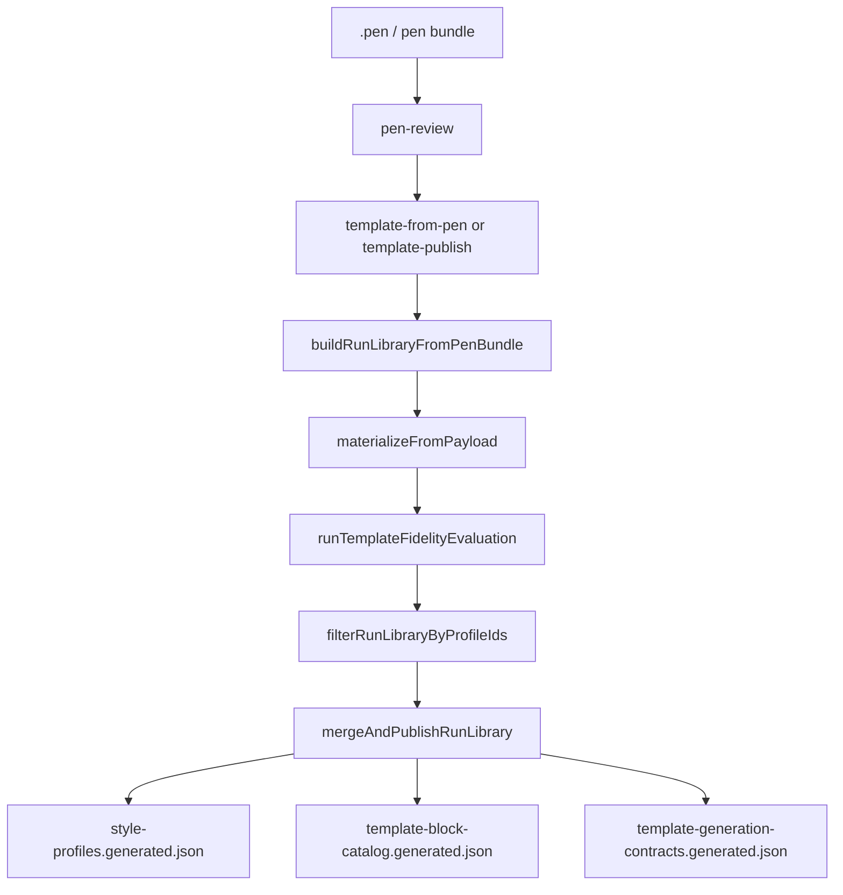

# 模板生成技术方案文档

## 1. 文档目的与范围

本文档说明当前 `template-factory` 的模板生产体系（pen-first）如何从 `.pen` 资产生成可发布模板库，并与网站生成链路联动。

覆盖范围：
- 模式与 CLI
- Pen Review / Pen Export / Run Library 构建
- Template Fidelity 与 Run Gates
- 组件物化（materialize）
- 发布与库合并
- 与 builder 生成链路衔接

核心代码入口：
- `builder/template-factory/run-template-factory.mjs`
- `builder/template-factory/config/schema.mjs`
- `builder/template-factory/config/resolve-options.mjs`
- `builder/template-factory/contracts/index.mjs`
- `builder/template-factory/gates/evaluate-run-gates.mjs`
- `builder/template-factory/materialize-custom-components.mjs`
- `builder/template-factory/README.md`

---

## 2. 目标与非目标

### 2.1 目标

1. 从已评审的 `.pen` 文件稳定提炼可复用模板资产。
2. 输出结构化模板库（profiles + block catalog + generation contracts）。
3. 在发布前执行 fidelity/gate 验证，阻断不合格模板进入共享库。
4. 将模板专属组件物化为静态 TSX，确保运行时/部署可用性。

### 2.2 非目标

1. 不再支持历史 URL/crawl 主流程作为模板生产主路径（当前以 pen-first 为唯一活跃主链路）。
2. 不绕过 review 与 fidelity 直接写库（除显式关闭开关外）。

---

## 3. 总体架构（Pen First）

---

## 4. 模式与命令

由 `run-template-factory.mjs` 主控。

活跃模式：
- `pen-review`
- `template-from-pen`（归一为 `template-publish`）
- `template-publish`
- `template-fidelity`

关键逻辑：
- 当 mode 为 `template-publish/template-fidelity` 且带 `--pen-file` 时，进入 `runTemplatePublishFromPenMode`。
- 若非上述，抛出“仅支持简化 pen-first 工作流”错误。

---

## 5. 配置系统

## 5.1 CLI 参数解析

`config/resolve-options.mjs`：
- 将 argv 转为 raw options
- 支持大量 flags（mode、pen file、fidelity、gate、并发、超时、发布开关等）

## 5.2 选项归一化

`config/schema.mjs`：
- 对数值执行 clamp
- 对枚举执行 normalize（mode/fidelity/policy/profile）
- 处理路径绝对化
- 统一默认值

重点字段：
- fidelity：`templateFidelity*`、`fidelityMode`、`fidelityThreshold`
- gate：`gateMin*`、`gateRequireKeyFlowIntegrity`
- publish：`publish`
- materialization：`templateExclusiveBlocks`、`autoPrivateBlocks`
- 并发与超时：`pipelineParallelConcurrency`、`regressionTimeoutMs` 等

---

## 6. 生产流程（详细）

## 6.1 Pen Review

- `runPenReviewMode`
- 输入：`--pen-file` + `--pen-review-file` + reviewer/status/notes
- 输出：review 文件（含每个 case 的审批状态）

作用：保证进入模板发布前有人审确认。

## 6.2 从 Pen 构建 Run Library

- `buildRunLibraryFromPenBundle`
- 过程：
  1. 读取 pen bundle / sidecar
  2. 提取 artifacts payload
  3. 汇总 profiles、page specs、template assets
  4. 生成 run 级 `style-profiles.generated.json`

输出目录：`template-factory/runs/<run-id>/...`

## 6.3 组件物化

`materialize-custom-components.mjs`：
- 将 payload 中 JIT 组件代码物化为静态 TSX：
  - `src/components/blocks/<kebab-name>/block.tsx`
- 自动生成/更新：
  - `src/puck/config.generated.ts`
  - `template-exclusive-runtime.generated.json`
- 提供字段检测与默认 props 推断，支持 Puck 配置注册。

价值：
- 降低生产运行时对 JIT 编译依赖。
- 确保 SSR/Cloudflare Pages 友好。

## 6.4 Fidelity 评估

- `runTemplateFidelityEvaluation`
- 输入：run artifacts + case file + replay 参数
- 输出：
  - `template-fidelity-report.json`
  - `template-fidelity/replay-case.payload.json`

核心检查：
- 结构相似度
- 截图相似度
- nav/footer 对比与对比度约束
- replay 稳定性

在 publish 流程中：
- fidelity 通过 profileId 白名单过滤 runLibrary
- 若过滤后 profileCount=0，直接失败

## 6.5 Run Gate 评估

`gates/evaluate-run-gates.mjs` 对站点级指标进行汇总判定，典型维度：
- required cases/pages 完整性
- pageSpec 覆盖率
- link success rate / nav-footer link success rate
- required role coverage
- design/accessibility/asset contract score
- similarity 阈值
- key flow integrity

支持 strict 模式与 `strictRequiredCasesPolicy`（ignore/warn/fail）。

## 6.6 发布与合并

- `mergeAndPublishRunLibrary`
- 合并来源：
  - 现有 `library/style-profiles.generated.json`
  - 当前 runLibrary
- 合并后发布：
  - `template-factory/library/style-profiles.generated.json`
  - `template-exclusive-components.generated.json`
  - `template-block-catalog.generated.json`
  - `template-generation-contracts.generated.json`

同时写 run 摘要：
- `pen-publish-summary.json`

---

## 7. 资产契约（Contract）

`contracts/index.mjs` 负责：
- 读取 corporate v1 协议定义：
  - page types
  - home skeletons
  - section taxonomy
  - review statuses
- 构建资产：
  - `template_asset_manifest`
  - `dedup_fingerprints`
  - `asset_contract_report`

运行时还可融合：
- fidelitySimilarity/fidelityThreshold
- review status transition 校验

这保证模板库在“结构正确 + 去重可控 + 生命周期可追踪”三方面可治理。

---

## 8. 输出产物一览

## 8.1 Run 级产物

- `template-factory/runs/<run-id>/style-profiles.generated.json`
- `template-factory/runs/<run-id>/pen-publish-summary.json`
- `template-factory/runs/<run-id>/template-fidelity-report.json`
- `template-factory/runs/<run-id>/materialized-components.json`
- `template-factory/runs/<run-id>/sites/<site-id>/extracted/*`

## 8.2 Library 级产物

- `template-factory/library/style-profiles.generated.json`
- `template-factory/library/template-exclusive-components.generated.json`
- `template-factory/library/template-block-catalog.generated.json`
- `template-factory/library/template-generation-contracts.generated.json`

## 8.3 代码级产物

- `src/puck/config.generated.ts`
- `src/components/blocks/template-exclusive-*/block.tsx`

---

## 9. 与网站生成链路的集成

## 9.1 读取关系

网站生成侧 `section-template-registry.ts` 自动加载发布库：
- 默认读取：`template-factory/library/style-profiles.generated.json`
- 可通过 `BUILDER_TEMPLATE_LIBRARY_PATH` 覆盖。

## 9.2 使用方式

`template-resolver.ts` 在 builder 阶段按 profile/pageType/sectionKinds 选用模板；
`p2w-graph.ts` 再融合 hardness、section 生成与全站统一化。

## 9.3 影响路径

当模板生产链路升级时，网站生成能力会同步受影响：
- page skeleton 覆盖率
- section 模板多样性
- nav/footer 样式壳层质量
- generation contract 的可执行性

结论：`pen -> template -> publish` 是网站生成质量的上游基础设施，必须纳入同一版本治理流程。

---

## 10. 质量与商用标准（模板侧）

1. Review 通过后才能 publish（非 fidelity-only 模式）。
2. Fidelity 至少保证结构与截图相似度不低于阈值。
3. Run Gate 不得存在 error 级问题。
4. 发布后模板库必须可被 builder 读取并在 sandbox 可渲染。
5. 模板专属组件应完成静态物化，避免运行时 fallback。

---

## 11. 典型运维流程

1. `pen-review` 标记审批。
2. `template-from-pen --no-publish` 预演。
3. 检查 run 产物与预览。
4. `template-publish` 正式发布。
5. 在 builder 跑一轮回归网站生成，验证模板命中与质量门禁。

---

## 12. 常见失败与定位

1. 失败：pen review not approved
- 位置：`runTemplatePublishFromPenMode`
- 处理：补 review 文件并设为 approved。

2. 失败：fidelity blocked all templates
- 位置：fidelity 过滤后 profileCount=0
- 处理：修复 case/template 结构映射，调整 fidelity 参数。

3. 失败：run gate 指标不足
- 位置：`evaluate-run-gates.mjs`
- 处理：查看具体维度（link/role/design/accessibility/similarity）。

4. 失败：组件物化冲突
- 位置：`materialize-custom-components.mjs`
- 处理：检查名称碰撞、签名去重与 config.generated 注册。

---

## 13. 扩展建议

1. 增加页面类型协议（contracts）时，同步更新：
- taxonomy/page-types schema
- builder page classifier + resolver

2. 增加模板资产版本化策略：
- library 按 version/tag 发布
- builder 按环境选择模板版本

3. 强化模板库可观测性：
- 记录 profile 命中率、命中后 QA 得分分布、回退率

4. 引入模板退役机制：
- 基于 review status + 线上质量分自动降级 `deprecated`

---

## 14. 总结

当前模板生成体系已实现“评审准入 -> fidelity 验证 -> gate 门禁 -> 库合并发布 -> 生成链路消费”的完整闭环。对网站生成质量的根因治理，应优先投入在模板侧资产质量、契约完整性与可回归能力上。
